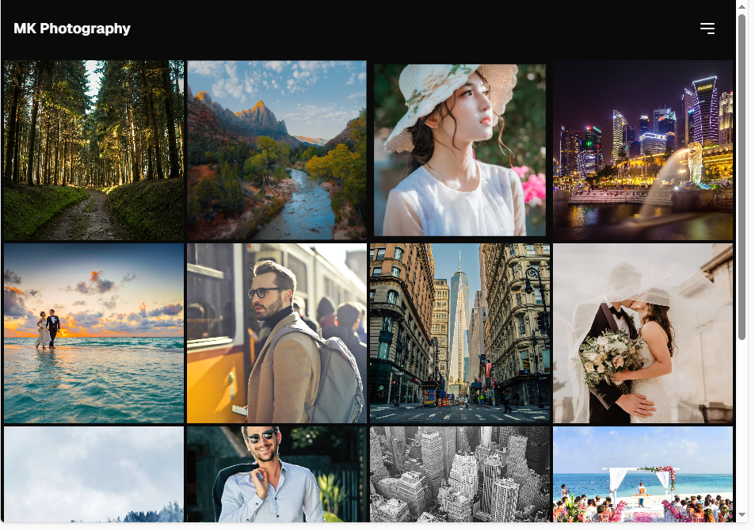
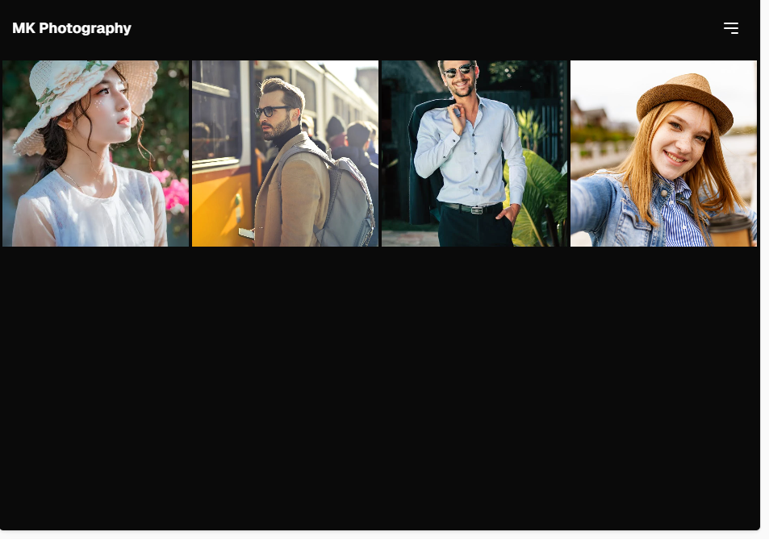
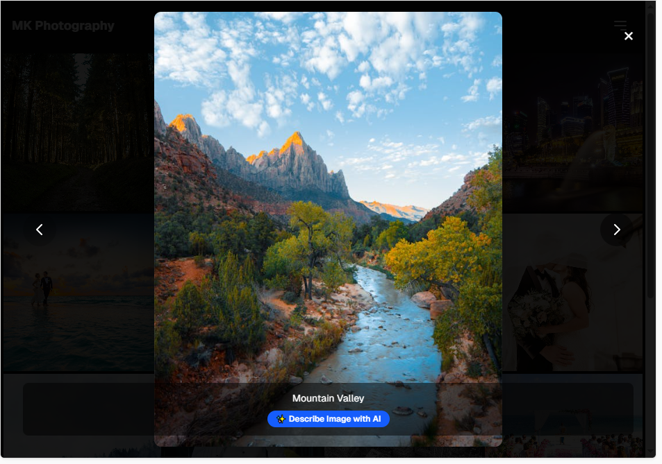
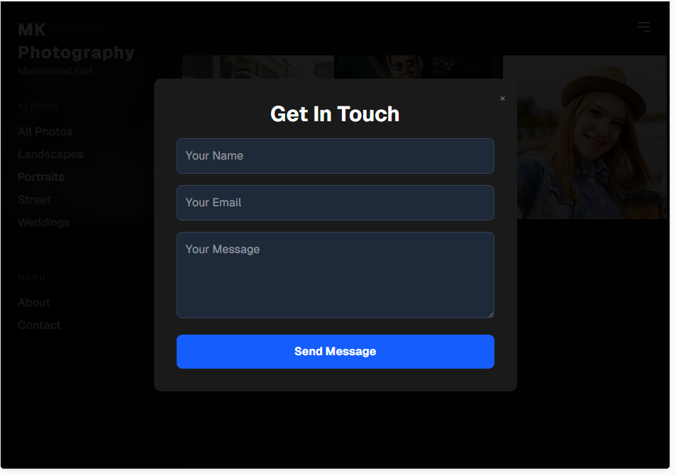
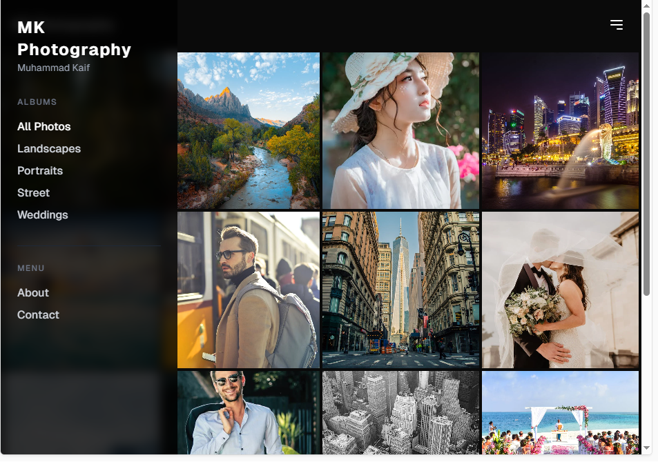

# Photography Portfolio

A simple Portfolio for Photography — a small web app to showcase photo albums, view image details and provide a contact form.

Built with JavaScript and CSS (Tailwind is included in the project).

---

## Features

- Home gallery / hero section
- Albums and album view
- Detailed image view (lightbox style)
- Contact form
- Responsive navigation (hamburger menu on small screens)

---

## Screenshots

Home  

Album view  

Detailed image view  

About / Bio  

Contact form  

Hamburger / mobile menu  

---

## Getting started — run locally

Prerequisites
- Node.js (v14+ recommended)
- npm or yarn

1. Clone the repository
   git clone https://github.com/Mkaify/Photography-Portfolio.git

2. Change into the project directory
   cd Photography-Portfolio

3. Install dependencies
   npm install
   (or `yarn`)

4. Start the development server
   npm run dev
   (or `npm start`, depending on the scripts in package.json — check `package.json` if a different script is defined)

5. Open the app in your browser
   Usually at http://localhost:3000 or http://localhost:5173 depending on the dev server used. Check the terminal output for the exact URL.

Build for production
- npm run build
- Serve the contents of the produced `dist` (or `build`) folder using any static server

---

## Notes

- If the startup script name differs, open `package.json` and use the script listed under `scripts` (for example `dev`, `start`, or similar).
- Images shown in the README are stored in the `SS` folder.

---

## License & Contact

This repository is provided as-is. For questions or contributions, open an issue or reach out via the contact form on the site.
